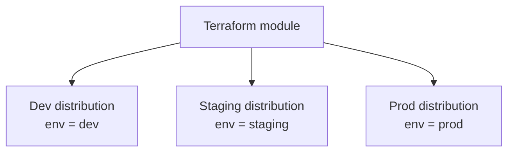
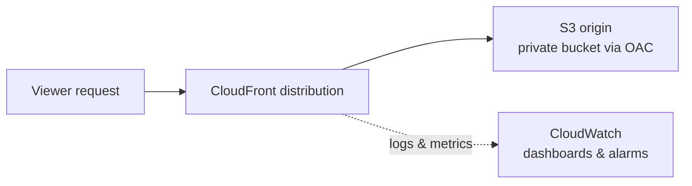

# CloudFront Terraform Multi-Environment

Reusable Terraform modules that provision isolated CloudFront + S3 delivery infrastructure across `dev`, `staging`, and `prod` environments, with CloudWatch monitoring built in.

This project was built as hands-on practice for AWS infrastructure engineering work — specifically, provisioning CDN infrastructure from reusable module patterns, securing S3 origins, and setting up observability, rather than a real production workload.

## What this project does

- Provisions a **private S3 bucket** per environment, locked down with Block Public Access and only reachable through CloudFront via **Origin Access Control (OAC)**.
- Provisions a **CloudFront distribution** per environment, pointed at that environment's S3 bucket, with HTTPS enforced.
- Uses **one shared Terraform module** for each piece of infrastructure (`modules/s3-origin`, `modules/cloudfront`), called separately by each environment with its own variable values — so `dev`, `staging`, and `prod` are fully independent, isolated stacks built from identical, reusable code.
- Stores Terraform state remotely in S3 with DynamoDB state locking, so state is safe and shareable rather than sitting on a single machine.
- (In progress) Adds CloudWatch dashboards, metrics, and alarms per distribution.

## Architecture

One module, called three times, produces three fully independent environments:



Inside each environment, a request flows through the distribution to a private origin, with everything logged for monitoring:



## Repository structure

```
.
├── modules/
│   ├── s3-origin/          # Private S3 bucket + OAC + bucket policy
│   │   ├── main.tf
│   │   ├── variables.tf
│   │   └── outputs.tf
│   │
│   ├─── cloudfront/         # CloudFront distribution + OAC
│   │   ├── main.tf
│   │   ├── variables.tf
│   │   └── outputs.tf
│   │
│   └── cloudwatch/         
│       ├── main.tf
│       ├── variables.tf
│       └── outputs.tf
│   
└── environments/
    ├── dev/
    │   ├── backend.tf      # Remote state config (unique state key per env)
    │   ├── providers.tf
    │   ├── variables.tf
    │   └── main.tf         # Calls both modules with dev-specific values
    ├── staging/
    └── prod/
```

Each `environments/<name>` folder is an independent Terraform root module: its own state file, its own `terraform init`/`plan`/`apply`, with no shared state between environments. This means an issue in `dev` can never affect `staging` or `prod`.

## Prerequisites

- An AWS account with the AWS CLI configured (`aws configure`) using a dedicated IAM user — not root — with least-privilege permissions for S3, CloudFront, IAM, and DynamoDB.
- [Terraform](https://developer.hashicorp.com/terraform/downloads) installed locally.
- An S3 bucket and DynamoDB table created manually ahead of time, to hold Terraform's remote state and locks (Terraform can't create the backend it's about to store its own state in).

## Setup and deployment

1. Clone the repository and `cd` into the environment you want to deploy, e.g. `environments/dev`.
2. Update `backend.tf` with your own state bucket, state key, region, and DynamoDB lock table name.
3. Update `main.tf` with a globally unique `bucket_name` for that environment (S3 bucket names must be unique across all of AWS).
4. Initialize Terraform:
   ```
   terraform init
   ```
5. Review the plan before applying anything:
   ```
   terraform plan
   ```
6. Apply:
   ```
   terraform apply
   ```
   CloudFront distributions typically take 5–15 minutes to fully deploy — this is expected AWS behavior, not a stuck command.
7. Repeat for `staging` and `prod` by copying the `dev` folder and changing the environment-specific values (bucket name, state key).

To tear an environment down:
```
terraform destroy
```
This only affects the environment you run it from, since each has its own isolated state.

## Modules

### `modules/s3-origin`
Creates a private S3 bucket with all public access blocked, plus a bucket policy that grants read access **only** to a specific CloudFront distribution, verified by matching the request's source ARN. The bucket is never reachable directly from the internet.

### `modules/cloudfront`
Creates an Origin Access Control (OAC) resource and a CloudFront distribution configured with a single default cache behavior, HTTPS-only viewer traffic, and no geographic restrictions. Outputs the distribution's ARN, ID, and public domain name for use elsewhere.

The two modules reference each other's outputs (the S3 module needs the CloudFront distribution's ARN for its bucket policy; the CloudFront module needs the S3 bucket's regional domain name as its origin) — Terraform resolves this dependency automatically via its graph, regardless of the order resources are declared in.

## Validation

Before and after any change, this project follows a few manual validation habits:
- Diffing response headers between the CloudFront URL and the S3 origin directly (`curl -I`) to confirm caching and security headers behave as expected.
- Checking the `x-cache` header to confirm cache hit/miss behavior matches the configured cache policy.
- Verifying origin connectivity and access control end-to-end after any infrastructure change.
- Maintaining a simple configuration inventory of each distribution's origins, behaviors, and functions as environments are added.

## Notes

- This project intentionally stays within AWS Free Tier usage for a portfolio/practice deployment — S3, CloudFront, and CloudWatch costs at this scale are negligible.
- New AWS accounts sometimes require manual verification from AWS Support before CloudFront distributions can be created (`AccessDenied: Your account must be verified...`). This is an account-level anti-abuse check unrelated to this Terraform configuration.

## Skills demonstrated

Terraform module design and reuse · AWS CloudFront configuration · S3 origin security (Origin Access Control, bucket policies, least-privilege IAM) · remote state management with locking · multi-environment infrastructure isolation · CloudWatch observability.